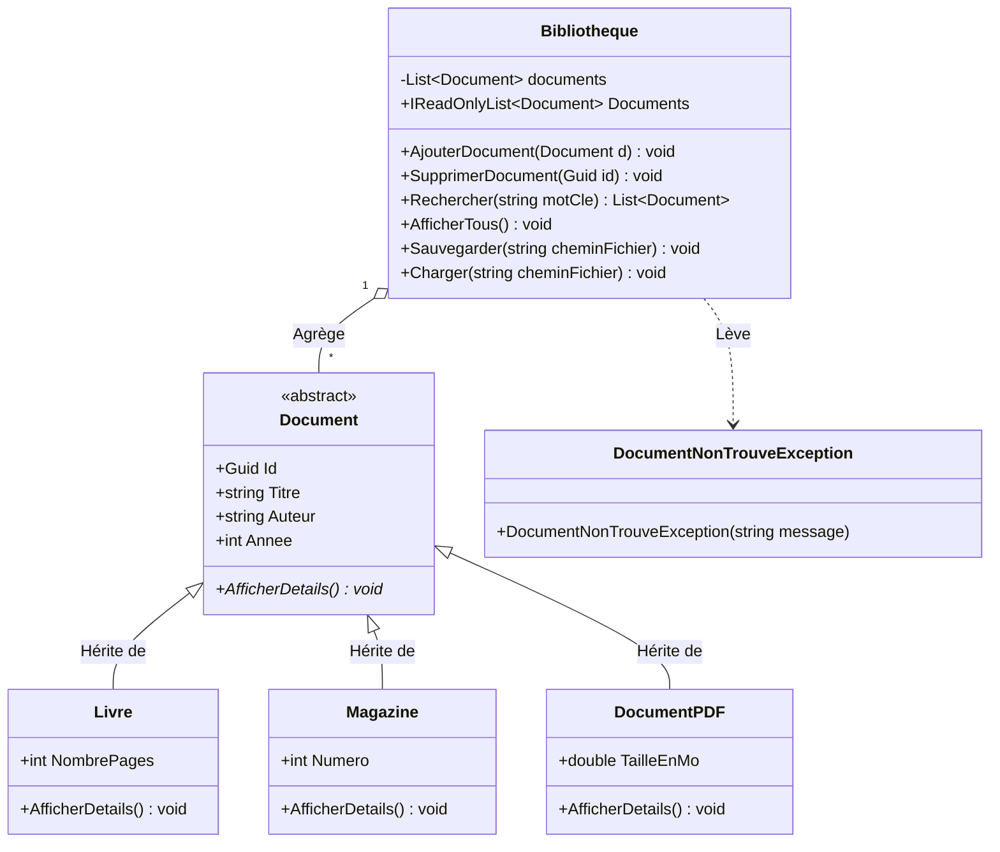
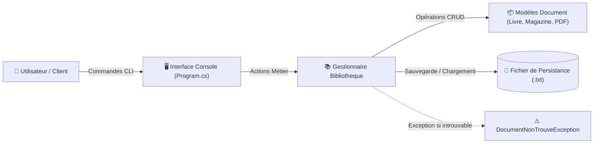

# 🚀 BIBLIO_DOTNET : Système de Gestion et d'Archivage Documentaire (.NET 8.0)

[](https://dotnet.microsoft.com/)
[](https://learn.microsoft.com/dotnet/csharp/)
[](https://github.com/tahalrh/BIBLIO_projet/actions)
[](https://xunit.net/)
[](https://www.docker.com/)
[](LICENSE)

---

## 📖 À propos du projet

Dans les environnements académiques, administratifs ou d'entreprise, la gestion manuelle ou dispersée des ressources documentaires entraîne des pertes d'informations, des doublons et un manque de traçabilité des supports.

**BIBLIO_DOTNET** est une solution logicielle modulaire et robuste conçue pour centraliser, indexer et sécuriser la gestion des fonds documentaires hétérogènes (livres papier, revues périodiques, documents numériques PDF).

### Valeur apportée :
* **Typage et extensibilité polymorphique :** Prise en charge unifiée des documents avec métadonnées spécialisées (pagination pour les livres, numérotation pour les magazines, taille de stockage pour les PDF).
* **Traçabilité stricte :** Chaque ressource est identifiée de manière unique par un identifiant universel standardisé (`GUID / UUID`).
* **Persistance transactionnelle :** Moteur d'exportation et d'importation structuré assurant l'intégrité des données même en cas d'interruption.
* **Architecture prête pour l'entreprise :** Conçue selon les principes SOLID, conteneurisée pour un déploiement instantané et testée unitairement via intégration continue.

---

## 🏗️ Architecture et Flux de données

### 1. Diagramme de Classes (Modèle du Domaine)



### 2. Flux d'Exécution et Persistance



---

## 🛠️ Stack Technologique

* **Langage & Framework :** C# 12 / .NET 8.0 LTS
* **Paradigmes :** Programmation Orientée Objet (POO), Encapsulation, Polymorphisme, Clean Code
* **Tests & Qualité :** xUnit, Coverlet, Test SDK Microsoft
* **Conteneurisation :** Docker (Multi-stage build sur images distroless/runtime), Docker Compose
* **CI/CD :** GitHub Actions (`build-and-test.yml`)

---

## ⚙️ Installation et Lancement

L'application est conçue pour être déployée rapidement et sans conflit d'environnement, soit nativement avec le SDK .NET, soit via Docker.

### Prérequis
* **Option A (Local) :** [.NET 8.0 SDK](https://dotnet.microsoft.com/download/dotnet/8.0) et [Git](https://git-scm.com/) installés.
* **Option B (Docker) :** [Docker Desktop](https://www.docker.com/products/docker-desktop/) installé et démarré.

---

### Instructions d'exécution

#### 1. Cloner le dépôt
```bash
git clone https://github.com/tahalrh/BIBLIO_projet.git
cd BIBLIO_projet
```

#### 2. Configuration des variables d'environnement
```bash
cp .env.example .env
```
*(Le fichier `.env` permet de définir le chemin du fichier de persistance des données `DATA_FILE_PATH`).*

#### 3. Méthode A : Exécution locale (.NET CLI)

```bash
# Restaurer les dépendances et compiler la solution
dotnet restore
dotnet build

# Lancer la suite de tests unitaires
dotnet test

# Démarrer l'application console
dotnet run
```

#### 4. Méthode B : Exécution conteneurisée (Docker Compose)

```bash
# Construire l'image et lancer l'application en mode interactif
docker compose run --rm biblio-app
```

---

## 🧪 Tests Unitaires

Une suite de tests automatisée valide la robustesse de chaque composant métier :

```bash
dotnet test Biblio_DOTNET.Tests/Biblio_DOTNET.Tests.csproj --verbosity normal
```

Cas de tests couverts :
* `AjouterDocument_DevraitAjouterDocumentCorrectement` : Vérification de l'insertion et de l'intégrité des métadonnées.
* `AjouterDocument_Null_DevraitLeverArgumentNullException` : Sécurité défensive contre les entrées nulles.
* `SupprimerDocument_IdExistant_DevraitRetirerDocument` : Suppression réussie par GUID.
* `SupprimerDocument_IdInexistant_DevraitLeverDocumentNonTrouveException` : Validation de l'exception métier personnalisée.
* `Rechercher_ParTitreOuAuteur_DevraitRetournerResultats` : Recherche insensible à la casse multi-critères.
* `SauvegarderEtCharger_DevraitPreserverTousLesTypesDeDocuments` : Persistance complète et désérialisation polymorphique.
